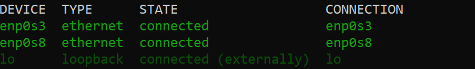
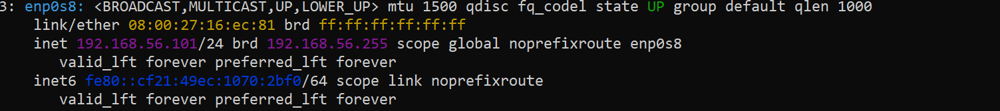
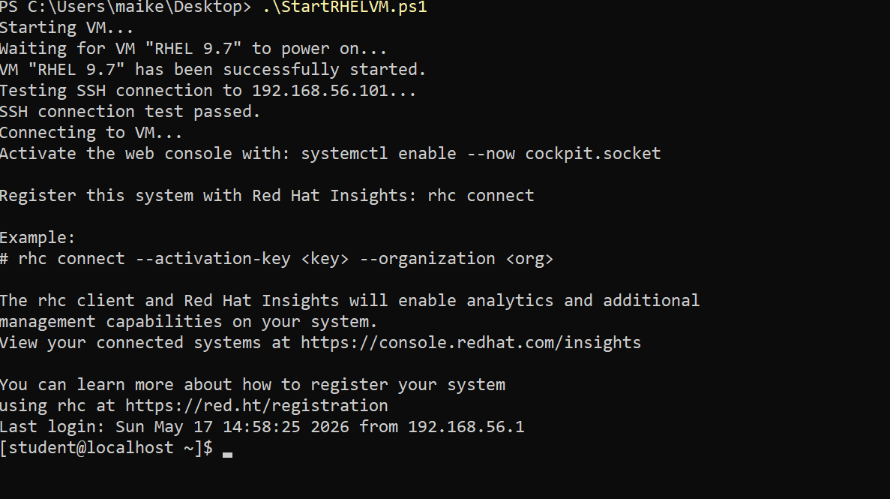

# PowerShell automation lab for starting a VM in VirtualBox, validating SSH connectivity, and connecting using key-based authentication


<br>

**Quick overview of the steps:**

- Give the Linux VM a static ip address.
- Create a public/private SSH key pair on local Windows machine. Transfer the public SSH key to the Linux VM.
- Fill out the PowerShell script with your information and save it to your desired location. Turn off the Linux VM if it is on. Run the script and confirm if it works.
 
 <br>

## Step 1. Assign a static IP address to the Linux VM.
We first assign a static ip address to the VM running in virtualbox.  If we don't assign a static ip address, should it change, we will need to keep going back into the script to update the ip.

Access the Linux VM. Identify the connection you want to give a static ip address to:
```
nmcli device status
```



In my example screenshot above, the connection profile I want to give a static ip address to is "enp0s8".  Use the below command to set the static ip address. NOTE, there is an example in the code block below on what it should look like when filled out correctly.:
```
sudo nmcli connection modify "Name of your connection profile" ipv4.method manual ipv4.addresses <Put the ip address you want here>/<Put the CIDR notation here> ipv4.never-default yes


EXAMPLE using my connection profile from the screenshot and the desired IP address:
sudo nmcli connection modify "enp0s8" ipv4.method manual ipv4.addresses 192.168.56.101/24 ipv4.never-default yes
```
 
 
 Next, bring the connection down:
```
 sudo nmcli connection down "Name of your connection profile w/o quotes"
```

Then bring the connection back up:
```
sudo nmcli connection up "Name of your connection profile w/o quotes"
```


We bring the connection down and then back up to ensure the settings stick. If we do not take this step, the ip address might not update.


Now, check that the connection profile has the ip address that you have set:
```
ip a show "Name of your connection profile w/o quotes"
```


The ip address was set to 192.168.56.101. Since the command we just ran shows that ip address, we are good to proceed.


<br>
<br>


## Step 2. Public/private SSH key creation.
Now that the ip address has been set statically on the Linux VM, we need to make a public/private SSH key pair. This key pair is what'll allow us to connect to the Linux VM without a password. To create a public/private SSH key pair on your Windows machine, open PowerShell as administrator and do the below:
```powershell
ssh-keygen -t ed25519 -f "$env:USERPROFILE\.ssh\<Put any name you want here>"
```


Now that the key pairs have been created, just to confirm, ensure they exist in the .ssh directory on your machine. In my instance, the .ssh directory was created in my user directory. If you go into that directory you will see the keys you just created. Note you will see one ending in ".pub". This .pub key is the one we will be sending over the Linux VM.


To send that public key over to Linux VM, do the below:
```powershell
Get-Content "$env:USERPROFILE\.ssh\<The name of your public SSH key file" | ssh <Your linux username>@<ip address of your Linux VM> "mkdir -p ~/.ssh && chmod 700 ~/.ssh && cat >> ~/.ssh/authorized_keys && chmod 600 ~/.ssh/authorized_keys"
```


Check that the public key was transferred to the Linux VM. Log in to the VM and then do the below, you should see an entry in the authorized_keys file:
```bash
cat .ssh/authorized_keys
```


<br>


<br>

## Step 3. Fill out the PowerShell script and run it.
Now that the public SSH key is on the Linux VM, fill out the PowerShell script below with your information. For myself, I put the script into PowerShell ISE, filled it out, and then saved it as a .ps1 file to my desktop for easy access.
``` powershell
$VMName = "Name of your VM in virtualbox"
$VMIP = "IP address of your VM. Remember, we set this earlier"
$Username = "Your Linux username"
$VBoxManage = "C:\Program Files\Oracle\VirtualBox\VBoxManage.exe"

# Check if VBoxManage exists
if (-not (Test-Path $VBoxManage)) {
    Write-Host "ERROR: VBoxManage.exe was not found."
    exit
}

# Start the VM
Write-Host "Starting VM..."
& $VBoxManage startvm $VMName --type headless

if ($LASTEXITCODE -ne 0) {
    Write-Host "WARNING: VM may already be running, or the VM name may be wrong."
}

# Test SSH connection
Write-Host "Testing SSH connection to $VMIP..."

$SSHTestPassed = $false

for ($i = 1; $i -le 15; $i++) {
    if (Test-NetConnection $VMIP -Port 22 -InformationLevel Quiet) {
        $SSHTestPassed = $true
        break
    }

    Write-Host "SSH connection test failed. Retrying..."
    Start-Sleep -Seconds 2
}

# If SSH test fails, stop the script
if ($SSHTestPassed -eq $false) {
    Write-Host "ERROR: SSH connection test failed. The VM is not reachable on port 22."
    exit
}

# If SSH test passes, connect
Write-Host "SSH connection test passed."
Write-Host "Connecting to VM..."

ssh -i "$env:USERPROFILE\.ssh\<Name of your private SSH key>" "$Username@$VMIP"
```


From here, either in your current administrator PowerShell session or in a new one, navigate to where the script is. Before running the script, ensure the Linux VM is powered off in virtualbox.



Per the screenshot above, we have confirmed that the script ran successfully and are now in the Linux VM.


